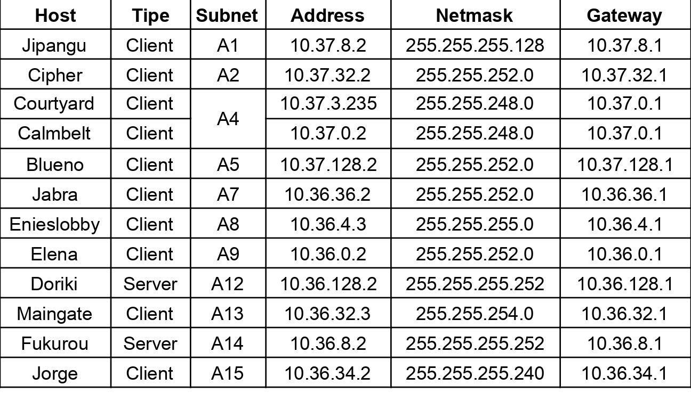

# Jarkom-Modul-4-E14-2021

**Anggota kelompok**:

- Dwi Wahyu Santoso (05111840000121)
- Khaela Fortunela (05111940000057)
- Husin Muhammad Assegaff (05111940000127)

---

## Tabel Konten

A. Jawaban

- [A. Topologi](#a-topologi)
- [B. VSLM pada CPT](#b-vlsm-pada-cpt)
  - [1. VLSM Subnetting](#1-vlsm-subnetting)
  - [2. VLSM Routing](#2-vlsm-routing)
- [C. CIDR pada GNS3](#c-cidr-pada-gns3)
  - [1. CIDR Subnetting](#1-cidr-subnetting)
  - [2. CIDR Routing](#2-cidr-routing)

B. Kendala

- [Kendala](#kendala)

---

## A. Topologi

Pembagian IP menggunakan Prefix IP yang telah ditentukan pada modul pengenalan. Prefix IP Address kelompok E14 kami adalah `10.36`.


## B. VLSM pada CPT

   ### 1. VLSM Subnetting
Berdasarkan topologi, ditemukan 15 subnet termasuk subnet untuk server dan router. Polanya seperti yang terlihat pada gambar di bawah ini. Selain itu ditambahkan juga besar netmask dari subnet tersebut berdasarkan jumlah ip yang dibutuhkan masing-masing subnet.


Pembagian IP menggunakan teknik VLSM memang tidak fleksible namun dalam pemakaian ip cukup efisien. Caranya terlihat seperti gambar di bawah ini.


### 2. VLSM Routing 
**a. Foosha**

Jalankan command berikut pada cmd router Foosha.
```
ip route 10.36.27.0 255.255.255.128 10.36.27.150            #A1
ip route 10.36.16.0 255.255.252.0 10.36.27.150              #A2
ip route 10.36.0.0 255.255.248.0 10.36.27.150               #A4
ip route 10.36.20.0 255.255.252.0 10.36.27.154              #A7
ip route 10.36.24.0 255.255.254.0 10.36.27.154              #A12
ip route 10.36.27.128 255.255.255.240 10.36.27.154          #A13
ip route 10.36.26.0 255.255.255.0 10.36.27.154              #A8
ip route 10.36.12.0 255.255.252.0 10.36.27.154              #A11
ip route 10.36.27.164 255.255.255.252 10.36.27.154          #A15
ip route 10.36.27.144 255.255.255.252 10.36.27.150	    #A3
ip route 10.36.27.156 255.255.255.252 10.36.27.154	    #A10
``` 
**b. Water7**

Jalankan command berikut pada cmd router Water7.
```      
ip route 0.0.0.0 0.0.0.0 10.36.27.149                       #FOOSHA
ip route 10.36.27.0 255.255.255.128 10.36.27.146            #A1
ip route 10.36.0.0 255.255.248.0 10.36.27.146               #A4
```      
      
**c. Pucci**

Jalankan command berikut pada cmd router Pucci.
```
ip route 0.0.0.0 0.0.0.0 10.36.27.145                       #WATER7
```
      
**d. Guanhao**

Jalankan command berikut pada cmd router Pucci.
```
ip route 0.0.0.0 0.0.0.0 10.36.27.149                       #FOOSHA
ip route 10.36.27.128 255.255.255.240 10.36.24.2            #A13
ip route 10.36.26.0 255.255.255.0 10.36.27.158              #A8
ip route 10.36.12.0 255.255.252.0 10.36.27.158              #A11
ip route 10.36.27.164 255.255.255.252 10.36.27.158          #A15
```
      
**e. Alabasta**

Jalankan command berikut pada cmd router Alabasta.
```
ip route 0.0.0.0 0.0.0.0 10.36.24.1                         #GUANHAO
```

**f. Oimo**

Jalankan command berikut pada cmd router Oimo.
```
ip route 0.0.0.0 0.0.0.0 10.36.24.1                         #GUANHAO
ip route 10.36.12.0 255.255.252.0 10.36.26.2                #A11
```

**g. Seastone**

Jalankan command berikut pada cmd router Seastone.
```
ip route 0.0.0.0 0.0.0.0 10.36.26.1                         #OIMO
```

## C. CIDR pada GNS3


### 1. CIDR Subnetting

Berikut proses penggabungan subnet-subnet dari paling bawah pada topologi:


Dari pengelompokan subnet tersebut didapatkan subnet terbesar memiliki 15 bit, sehingga pohon pembagian IP dapat dibuat menjadi sebagai berikut:


Setelah didapatkan IP pada setiap subnet paling bawah, maka dicari netmask dan broadcast pada setiap subnet tersebut. Hasilnya sebagai berikut,
<table>
<thead>
      <tr>
            <th  style="text-align: center;">Subnet</th>
            <th  style="text-align: center;">Bit</th>
            <th  style="text-align: center;">Network ID</th>
            <th  style="text-align: center;">Netmask</th>
            <th  style="text-align: center;">Broadcast Address</th>
      </tr>
</thead>
<tbody>
      <tr>
            <td  style="text-align: center;">A1</td>
            <td  style="text-align: center;">/25</td>
            <td  style="text-align: center;">10.37.8.0</td>
            <td  style="text-align: center;">255.255.255.128</td>
            <td  style="text-align: center;">10.37.8.127</td>
      </tr>
      <tr>
            <td  style="text-align: center;">A2</td>
            <td  style="text-align: center;">/22</td>
            <td  style="text-align: center;">10.37.32.0</td>
            <td  style="text-align: center;">255.255.255.0</td>
            <td  style="text-align: center;">10.37.35.255</td>
      </tr>
      <tr>
            <td  style="text-align: center;">A3</td>
            <td  style="text-align: center;">/30</td>
            <td  style="text-align: center;">10.37.16.0</td>
            <td  style="text-align: center;">255.255.255.252</td>
            <td  style="text-align: center;">10.37.16.3</td>
      </tr>
      <tr>
            <td  style="text-align: center;">A4</td>
            <td  style="text-align: center;">/21</td>
            <td  style="text-align: center;">10.37.0.0</td>
            <td  style="text-align: center;">255.255.248.0</td>
            <td  style="text-align: center;">10.37.7.255</td>
      </tr>
      <tr>
            <td  style="text-align: center;">A5</td>
            <td  style="text-align: center;">/22</td>
            <td  style="text-align: center;">10.37.128.0</td>
            <td  style="text-align: center;">255.255.252.0</td>
            <td  style="text-align: center;">10.37.131.255</td>
      </tr>
      <tr>
            <td  style="text-align: center;">A6</td>
            <td  style="text-align: center;">/30</td>
            <td  style="text-align: center;">10.37.64.0</td>
            <td  style="text-align: center;">255.255.255.252</td>
            <td  style="text-align: center;">10.37.64.3</td>
      </tr>
      <tr>
            <td  style="text-align: center;">A6</td>
            <td  style="text-align: center;">/30</td>
            <td  style="text-align: center;">10.37.64.0</td>
            <td  style="text-align: center;">255.255.255.252</td>
            <td  style="text-align: center;">10.37.64.3</td>
      </tr>
      <tr>
            <td  style="text-align: center;">A7</td>
            <td  style="text-align: center;">/22</td>
            <td  style="text-align: center;">10.36.36.0</td>
            <td  style="text-align: center;">255.255.252.0</td>
            <td  style="text-align: center;">10.36.39.255</td>
      </tr>
      <tr>
            <td  style="text-align: center;">A8</td>
            <td  style="text-align: center;">/24</td>
            <td  style="text-align: center;">10.36.4.0</td>
            <td  style="text-align: center;">255.255.255.0</td>
            <td  style="text-align: center;">10.36.4.255</td>
      </tr>
      <tr>
            <td  style="text-align: center;">A9</td>
            <td  style="text-align: center;">/22</td>
            <td  style="text-align: center;">10.36.0.0</td>
            <td  style="text-align: center;">255.255.252.0</td>
            <td  style="text-align: center;">10.36.3.255</td>
      </tr>
      <tr>
            <td  style="text-align: center;">A10</td>
            <td  style="text-align: center;">/30</td>
            <td  style="text-align: center;">10.36.64.0</td>
            <td  style="text-align: center;">255.255.255.252</td>
            <td  style="text-align: center;">10.36.64.3</td>
      </tr>
      <tr>
            <td  style="text-align: center;">A11</td>
            <td  style="text-align: center;">/30</td>
            <td  style="text-align: center;">10.36.16.0</td>
            <td  style="text-align: center;">255.255.255.252</td>
            <td  style="text-align: center;">10.36.16.3</td>
      </tr>
      <tr>
            <td  style="text-align: center;">A12</td>
            <td  style="text-align: center;">/30</td>
            <td  style="text-align: center;">10.36.128.0</td>
            <td  style="text-align: center;">255.255.255.252</td>
            <td  style="text-align: center;">10.36.128.3</td>
      </tr>
      <tr>
            <td  style="text-align: center;">A13</td>
            <td  style="text-align: center;">/23</td>
            <td  style="text-align: center;">10.36.32.0</td>
            <td  style="text-align: center;">255.255.254.0</td>
            <td  style="text-align: center;">10.36.33.255</td>
      </tr>
      <tr>
            <td  style="text-align: center;">A14</td>
            <td  style="text-align: center;">/30</td>
            <td  style="text-align: center;">10.36.8.0</td>
            <td  style="text-align: center;">255.255.255.252</td>
            <td  style="text-align: center;">10.36.8.3</td>
      </tr>
      <tr>
            <td  style="text-align: center;">A15</td>
            <td  style="text-align: center;">/28</td>
            <td  style="text-align: center;">10.36.34.0</td>
            <td  style="text-align: center;">255.255.255.240</td>
            <td  style="text-align: center;">10.36.34.15</td>
      </tr>
</tbody>
</table>

### 2. CIDR Routing

#### Setting Network Configuration

**A. Server** 


- Foosha 

      
      auto eth0
      iface eth0 inet dhcp

      auto eth1
      iface eth1 inet static
            address 10.37.64.1
            netmask 255.255.255.252

      auto eth2
      iface eth2 inet static
            address 10.37.128.1
            netmask 255.255.252.0

      auto eth3
      iface eth3 inet static
            address 10.36.64.1
            netmask 255.255.255.252

      auto eth4
      iface eth4 inet static
            address 10.36.128.1
            netmask 255.255.255.252
      

- Water7

      
      auto eth0
      iface eth0 inet static
            address 10.37.64.2
            netmask 255.255.255.252
            gateway 10.37.64.1

      auto eth1
      iface eth1 inet static
            address 10.37.16.1
            netmask 255.255.255.252

      auto eth2
      iface eth2 inet static
            address 10.37.32.1
            netmask 255.255.255.0
      

- Pucci

      auto eth0
      iface eth0 inet static
            address 10.37.16.2
            netmask 255.255.255.252
            gateway 10.37.16.1

      auto eth1
      iface eth1 inet static
            address 10.37.8.1
            netmask 255.255.255.128

      auto eth2
      iface eth2 inet static
            address 10.37.0.1
            netmask 255.255.248.0


- Guanhao
      
      auto eth0
      iface eth0 inet static
            address 10.36.64.2
            netmask 255.255.255.252
            gateway 10.36.64.1

      auto eth1
      iface eth1 inet static
            address 10.36.16.1
            netmask 255.255.255.252

      auto eth2
      iface eth2 inet static
            address 10.36.36.1
            netmask 255.255.252.0

      auto eth3
      iface eth3 inet static
            address 10.36.32.1
            netmask 255.255.254.0
      

- Alabasta
      
      auto eth0
      iface eth0 inet static
            address 10.36.32.2
            netmask 255.255.254.0
            gateway 10.36.32.1

      auto eth1
      iface eth1 inet static
            address 10.36.34.1
            netmask 255.255.255.240
      

- Omo
      
      auto eth0
      iface eth0 inet static
            address 10.36.16.2
            netmask 255.255.255.252
            gateway 10.36.16.1

      auto eth1
      iface eth1 inet static
            address 10.36.4.1
            netmask 255.255.255.0

      auto eth2
      iface eth2 inet static
            address 10.36.8.1
            netmask 255.255.255.252
      

- Seastone
      
      auto eth0
      iface eth0 inet static
            address 10.36.4.2
            netmask 255.255.255.0
            gateway 10.36.4.1

      auto eth1
      iface eth1 inet static
            address 10.36.0.1
            netmask 255.255.252.0
      
**B. Host** 



- Jipangu
      
      
      auto eth0
      iface eth0 inet static
            address 10.37.8.2
            netmask 255.255.255.128
            gateway 10.37.8.1
      

- Cipher
      
      
      auto eth0
      iface eth0 inet static
            address 10.37.32.2
            netmask 255.255.255.0
            gateway 10.37.32.1
      

- Courtyard
      
      
      auto eth0
      iface eth0 inet static
            address 10.37.0.2
            netmask 255.255.248.0
            gateway 10.37.0.1

- Calmbelt
      
      
      auto eth0
      iface eth0 inet static
            address 10.37.0.3
            netmask 255.255.248.0
            gateway 10.37.0.1
      

- Blueno
      
      
      auto eth0
      iface eth0 inet static
            address 10.37.128.2
            netmask 255.255.252.0
            gateway 10.37.128.1
      

- Jabra
      
      
      auto eth0
      iface eth0 inet static
            address 10.36.36.2
            netmask 255.255.252.0
            gateway 10.36.36.1
      

- Enieslobby
      
      
      auto eth0
      iface eth0 inet static
            address 10.36.4.2
            netmask 255.255.255.0
            gateway 10.36.4.1
      

- Elena
      
      
      auto eth0
      iface eth0 inet static
            address 10.36.0.2
            netmask 255.255.252.0
            gateway 10.36.0.1
      
- Maingate

      auto eth0
      iface eth0 inet static
            address 10.36.32.3
            netmask 255.255.254.0
            gateway 10.36.32.1


- Doriki

      
      auto eth0
      iface eth0 inet static
            address 10.36.128.2
            netmask 255.255.255.252
            gateway 10.36.128.1
      

- Fukurou
      
      
      auto eth0
      iface eth0 inet static
            address 10.36.8.2
            netmask 255.255.255.252
            gateway 10.36.8.1
      

- Jorge
      
      
      auto eth0
      iface eth0 inet static
            address 10.36.34.2
            netmask 255.255.255.240
            gateway 10.36.34.1
      

#### Routing

- Foosha

      route add -net 10.37.8.0 netmask 255.255.255.128 gw 10.37.64.2          #A1-jipangu
      route add -net 10.37.32.0 netmask 255.255.252.0 gw 10.37.64.2           #A2-cipher
      route add -net 10.37.16.0 netmask 255.255.255.252 gw 10.37.64.2         #A3-pucci
      route add -net 10.37.0.0 netmask 255.255.248.0 gw 10.37.64.2            #A4-calmbelt-courtyard
      route add -net 10.36.36.0 netmask 255.255.252.0 gw 10.36.64.2           #A7-jabra
      route add -net 10.36.4.0 netmask 255.255.255.0 gw 10.36.64.2            #A8-enieslobby
      route add -net 10.36.0.0 netmask 255.255.252.0 gw 10.36.64.2            #A9-elena
      route add -net 10.36.16.0 netmask 255.255.255.252 gw 10.36.64.2         #A11-oimo
      route add -net 10.36.32.0 netmask 255.255.254.0 gw 10.36.64.2           #A13-maingate
      route add -net 10.36.8.0 netmask 255.255.255.252 gw 10.36.64.2          #A14-fukurou
      route add -net 10.36.34.0 netmask 255.255.255.240 gw 10.36.64.2         #A15-jorge

- Water7

      route add -net 10.37.8.0 netmask 255.255.255.128 gw 10.37.16.2          #A1-jipangu
      route add -net 10.37.0.0 netmask 255.255.248.0 gw 10.37.16.2            #A4-calmbelt-courtyard
      route add -net 0.0.0.0 netmask 0.0.0.0 gw 10.37.64.1                    #default

- Pucci

      route add -net 0.0.0.0 netmask 0.0.0.0 gw 10.37.16.1                    #default

- Guanhao

      route add -net 10.36.4.0 netmask 255.255.255.0 gw 10.36.16.2            #A8-enieslobby
      route add -net 10.36.0.0 netmask 255.255.252.0 gw 10.36.16.2            #A9-elena
      route add -net 10.36.8.0 netmask 255.255.255.252 gw 10.36.16.2          #A14-fukurou
      route add -net 10.36.34.0 netmask 255.255.255.240 gw 10.36.32.2         #A15-jorge
      route add -net 0.0.0.0 netmask 0.0.0.0 gw 10.36.64.1                    #default

- Alabasta

      route add -net 0.0.0.0 netmask 0.0.0.0 gw 10.36.32.1                    #default

- Oimo

      route add -net 10.36.0.0 netmask 255.255.252.0 gw 10.36.4.2             #A9-elena
      route add -net 0.0.0.0 netmask 0.0.0.0 gw 10.36.16.1                    #default

- Seastone

      route add -net 0.0.0.0 netmask 0.0.0.0 gw 10.36.4.1                     #default

#### Iptables Foosha

Pada router **Foosha** jalankan perintah berikut ini,
      
      iptables -t nat -A POSTROUTING -o eth0 -j MASQUERADE -s 10.36.0.0/15

#### Konfigurasi Router

Untuk semua router, berdasarkan perhitungan CIDR ditambahkan jangakauan ipnya.

- Guanhao
```
iptables -t nat -A POSTROUTING -o eth0 -j MASQUERADE -s 10.36.0.0/17
```

- Oimo
```
iptables -t nat -A POSTROUTING -o eth0 -j MASQUERADE -s 10.36.0.0/19
```

- Seastone
```
iptables -t nat -A POSTROUTING -o eth0 -j MASQUERADE -s 10.36.0.0/22
```

- Water7
- Pucci


#### Setting resolv.conf

Pada semua node selain Foosha (termasuk router-router lain), jalankan perintah berikut ini.

      echo nameserver 192.168.122.1 > /etc/resolv.conf


## Kendala

Masih belum terlalu paham sistem routing pada setiap router di GNS3 
